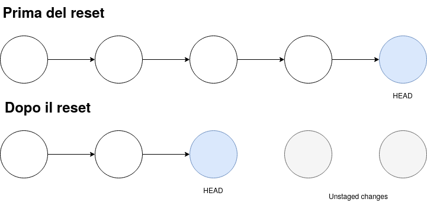

## Introduzione al versioning

Il software attraversa molteplici fasi di sviluppo e versioni, dal momento della modifica del file sorgente fino alla creazione di versioni di test, alpha, beta e finali. Queste versioni vengono create per diverse piattaforme e per diversi rilasci di prodotto.

Il versionamento del codice gestisce e **tiene traccia** di queste diverse versioni, consentendo il **recupero** di versioni precedenti per risolvere eventuali bug introdotti nelle versioni più recenti e la gestione di più versioni in contemporanea.

Questi strumenti agevolano lo **sviluppo collaborativo** e la gestione di documenti e programmi, estendendosi anche a file binari come le immagini. Il versionamento del codice è una pratica comune e utile non solo per il codice sorgente, ma per l'intera base di codice, inclusa la documentazione e i file di configurazione.

### Tipi di sistemi di versionamento

Esistono diversi sistemi per il controllo di versione(version controlsystems-**VCS**):

- **Locali**: mantengono un archivio dei cambiamenti del software sul computer usato per lo sviluppo. Hanno il vantaggio di essere molto **facili** da usare perché non è richiesta nessuna attività al programmatore, ma lo svantaggio di **non consentire la collaborazione** con altri utenti, la mancanza di sicurezza dato che non offrono una funzione di backup e il fatto che la storia della codebase è vista file per file, **senza la possibilità di sapere quali file fossero in quale versione** in un certo momento dello sviluppo.

- **Centralizzati**: sono gli strumenti più "tradizionali", come **CVS** o **Subversion**.
  L'archivio è mantenuto su di un **server centrale**, mentre gli sviluppatori lavorano su una copia locale di uno degli stati del software.
  Si usano delle operazioni di **checkout** per prelevare uno stato del sistema dal server(es.la versione più recente), e con un'operazione di **commit** si inviano le proprie modifiche per aggiornare lo stato sul server.

- **Distribuiti**: sono i sistemi, come **Git** o **Mercurial**, in cui **il sistema locale ha una copia completa** della storia dello sviluppo, per cui si può lavorare con sistema diversionamento anche senza connessione. Dato che sono distribuiti non si ha più un server centrale di riferimento se non per convenzione comune.

## Hello git: workflow di base

Git è un software che permette di **tenere traccia** dei cambiamenti fatti su un progetto nel tempo. Git ricorda ogni modifica, tenendone traccia e dando la possibilità di **accedere ad ogni versione** salvata del progetto.

### I 3 stadi di un progetto git

Possiamo semplificare (di molto) il workflow di git dividendolo in 3 parti:

1. Effettuo delle modifiche al progetto (aggiunta/rimozione/modifica di files).
2. Aggiungo le modifiche alla lista di modifiche pronte per essere "committate" (detta **staging area**).
3. Salvo i cambiamenti in una **commit**, le commit vengono conservate nella **git repository**.


> La Working Directory è quindi la directory del progetto nello stato attuale

```sh
# Primo utilizzo di git: configurare i dati relativi all'autore
git config --global user.name "Nome Cognome"
git config --global user.email indirizzo@ema.il

git init # init = initialize, inizializza tutti gli strumenti necessari al versioning (nella cartella .git)
git status # Visualizza lo stato del branch
git add <filename> # Aggiunge le modifiche relative al file/ai file alla staging area sopra citata
git add <filename> <otherFilename> ... # Posso specificare anche più di un file alla volta
git add -A # Aggiunge tutte le modifiche pendenti alla staging area
git commit -m"<comment>" # Salva permanentemente come commit le modifiche
git commit --amend -m"<comment>" # Sovrascrive l'ultima commit effettuata, utile per mantenere la history pulita e chiara in caso di piccole sviste
```

Convenzioni riguardanti i commenti:

- Dovrebbero essere in [Present Tense](https://learnenglish.britishcouncil.org/grammar/english-grammar-reference/present-tense)
- Non dovrebbero superare i 50 caratteri


> I files in verde sono gli staged files, quelli rossi sono quelli in attesa di essere aggiunti alla staging area

> Al posto dei nomi dei files volendo si possono usare le [wildcards](https://www.tecmint.com/use-wildcards-to-match-filenames-in-linux/) offerte da bash!

### git diff: vedere le modifiche effettute

Git ci permette di vedere le **differenze** tra i files della working directory e la staging area (molti editor/IDE supportano Git e forniscono uno strumento grafico per vedere questo, naturalmente essi si appoggiano al comando fornito da git).

```sh
git diff <filename> # Visualizza la lista dei cambiamenti di un file rispetto alla staging area
```


### git log & git blame: lo storico

Le commit possono essere viste grazie ad uno **storico** (come vedremo, lo storico può essere sia locale che remoto).<br>
È inoltre possibile per ogni riga di ogni file **sapere chi** (ed in quale commit) ha effettuato l'ultimo cambiamento a quella riga.

```sh
git blame <filename> # Stampa ogni riga del file, con hash autore e data dell'ultima commit che ha avuto a che fare con quella riga
git log # Stampa a video lo storico delle commit
git log --pretty=oneline # Stampa le commit in formato abbreviato, facendo occupare una sola riga per commit
git log --graph # Stampa a terminale le commit con un grafo che fa capire lo stato dei vari branch
```

Screenshot di una sezione dello storico in modalità grafo:


> In arancione possiamo vedere un codice alfanumerico di 40 caratteri, questo è l'hash o SHA della commit e viene usato come identificativo per riferirsi alla commit.

## Backtracking: ritornare sui propri passi

### git show e head commit

`HEAD` identifica la commit in cui si è attualmente (spesso coincide con l'ultima commit dello storico, ma non è detto)

```sh
git show HEAD # Stampa i dati relativi alla commit in cui si è (dati dello storico + dati modifiche effettuate)
git show <hash> # Stampa i dati relativi alla commit identificata dall'hash
```

> In un certo senso `git show` è come un `git log` SOLO di una commit + `git diff`


### git checkout

```sh
git checkout HEAD <filename> # Riporta il file allo stato in cui era all'ultma commit, se non specificato HEAD è impostato di default
# git checkout HEAD <filename> == git checkout <filename>
git checkout <hash> <filename> # Riporta il file allo stato in cui era nella commit specificata
git checkout <hash> # Porta la HEAD alla commit specificata, riportando tutti i file allo stato che erano in quella commit, ma mantenendo nello storico i cambiamenti effettuati dopo.
# Utile se si vuole ad esempio creare un nuovo branch partendo da una commit passata
```

### git reset

```sh
git reset <filename> # Toglie il file dalla staging area (img 1)
git reset <SHA> # Riporta i file e la HEAD alla commit specificata, eliminando dallo storico tutte le commit dopo la commit specificata (img 2)
# NOTA: i cambiamenti non sono persi, ma semplicemente "diventano rossi" ovvero in attesa di essere annullati o aggiunti alla staging area
```

> Qui (come in tutti i comandi visti fin ora per riferirsi ad una commit bastano i primi 7 caratteri dell'hash)




## Branching

Fin ora abbiamo sempre lavorato nel **branch** creato automaticamente con la `init` di un progetto git, ovvero `master` (recentemente si vede `main` al posto di master).<br>
Git ci permette di creare infiniti branch, in questo modo è possibile avere infinite versioni del progetto che **coesistono** allo stesso momento, le modifiche apportate dai vari branch possono essere allineate tramite una **merge**.<br>
Spesso i branch sono utilizzati per aggiungere nuove feature e per far lavorare in parallelo più sviluppatori.

```sh
git branch # Lista dei branch, che evidenzia il branch attivo
git branch --all # Lista di tutti i branch, quelli in rosso sono i branch remoti
git branch <branch> # Crea un nuovo branch, che parte dalla HEAD
git checkout -b <branch> # Crea un nuovo branch, che parte dalla HEAD e cambia il branch attivo in quello appena creato
git checkout <branch> # Cambia il branch attivo
```


### Parentesi riguardo git log

Come si vede nell'immagine qui sotto `git log` di default mostra solo lo storico delle commit **relative al branch** attivo, è però possibile stampare a video lo storico di tutte le commit utilizzando il flag `--all`.


### git merge

> Quando possibile appoggiarsi sempre ad una soluzione grafica per i merge, in modo da gestire con più facilità i possibili conflitti.

```sh
git merge <branch> # Effettua il merge del branch specificato all'interno del branch corrente
git branch -d <branch> # Cancella il branch (se non è il branch corrente) SE E SOLO SE quel branch è già stato mergiato
git branch -D <branch> # Cancella il branch (se non è il branch corrente) in ogni caso
```

> Se il branch corrente è semplicemente più indietro di qualche commit il risultato della merge sarà un **fast forward**


### git rebase

`git rebase` è un'operazione avanzata di gestione dei rami che consente di **modificare la storia** dei commit in un repository. Più specificamente, il comando `git rebase` consente di riapplicare una serie di commit su una base differente rispetto a quella originale in cui sono stati creati.

Di solito, questo viene fatto per due ragioni principali:

1. **Integrare modifiche da un ramo all'altro**: Se hai creato un ramo separato per lavorare su una funzionalità e nel frattempo ci sono state modifiche sul ramo principale, puoi utilizzare `git rebase` per **integrare** le modifiche dal ramo principale nel tuo ramo di funzionalità **senza creare commit di merge** aggiuntivi.

2. **Riorganizzare la storia dei commit**: Può capitare che i commit siano stati creati in un ordine non ottimale o che vogliamo riorganizzare la storia dei commit per renderla più comprensibile o pulita. In questo caso, `git rebase` può essere utilizzato per riorganizzare, combinare, modificare o eliminare i commit.

```sh
git rebase <branch> # Fa il rebase del branch corrente sulla base del branch indicato
```

## Teamwork: come collaborare

Per collaborare serve che ogni sviluppatore abbia:

- Una replica del codice sul suo computer
- Un modo per tenere traccia delle modifiche sul suo computer
- Accesso alla versione definitiva del progetto

Tutto questo può essere ottenuto utilizzando i `remotes`.<br>
Un **remote** è una **shared git repository**, ovvero messa su di un **server** git.

### git clone

```sh
git clone <remote_path> <name> # Clona un progetto (clonandone anche i remote) ed assegna il nuovo nome alla cartella
# NOTA: se non si specifica il nome esso sarà uguale al nome della repository remota
```

### git remote

```sh
git remote -v # Stampa a video la lista dei remotes, ovvero le varie repository remote collegate al progetto
git remote add <name> <remote_path> # Aggiunge un remote alla cartella (il 99% delle volte name = origin)
git remote remove <name> # Rimuove il remote specificato dalla repository
```

Il nome di default, ed usato per convenzione, della cartella remota principale è origin.<br>
Se si vuole il nome può essere anche cambiato.


> Come si vede sopra origin è specificato 2 volte, una per le **fetch** ed una per le **push**.
> Vedremo più avanti il significato preciso di queste azioni, il concetto base da sapere è che fetch indica la **lettura** e push la **scrittura**

# git fetch & git pull

Se mentre stiamo lavorando un altro sviluppatore pusha delle commit sulla repository remota ci serve fare una `git fetch` per avere accesso a quei cambiamenti.
La fetch non aggiorna il branch, ma semplicemente controlla lo stato del branch remoto corrispondente al nostro branch.

Per recuperare le modifiche remote si possono usare 2 metodi equivalenti:

```sh
# Metodo 1: non mi serve una fetch esplicita, è implicita nella pull:
git pull # La prima volta va specificato il branch remoto da associare al nostro branch (es. git pull origin master)
# Metodo 2: mi serve una fetch esplicita
git fetch
git merge <origin_name>/<branch>

# bonus
git pull --rebase # comando utile se si sta lavorando contemporaneamente sullo stesso branch e non si può committare
```

### git push

La push serve per mandare le commit locali sul branch corrispondente della repository remota

```sh
# Metodo 1: non mi serve una fetch esplicita, è implicita nella pull:
git push <remote_name> <branch> # Dopo la prima volta non serve più specificare remote e branch remoto
git push --force # Azione pericolosa ma a volte utile... sovrascrive il branch remoto fregandosene della situazione
```

## BONUS: Creare un proprio git server

> Questa guida elenca i passaggi da fare su un sistema debian-based (nello specifico è presa da un sito che usa un rasperry pi, con **raspbian**)<br>
> Link tra le fonti.

### Installazione e configurazione di git

```sh
sudo apt-get install git-core
```

Per motivi di sicurezza e semplicità, è bene che i repository Git appartengano ad un **apposito utente**, che chiamiamo git. Tale utente avrà come home personale, che è poi la directory dove andranno i repository, `/mnt/disco/git` (assumendo che /mnt/disco sia la directory sulla quale è montato il disco esterno).<br>
Creiamo l’utente (e il relativo gruppo):

```sh
adduser --system --shell /bin/bash --gecos 'git version control by pi' --group --home /mnt/disco/git git
passwd git # Diamo una password al nuovo utente/gruppo
```

### Creare una repository

Siamo dunque pronti a creare il nostro primissimo repository. Esistono due tipi di repository Git: quelli **semplici**, che contengono i file della versione attuale e una directory .git con le informazioni necessarie al versionamento, e i repository **bare**, che espongono tutta la struttura del versionamento e non mostrano comodamente la versione corrente. Il primo tipo viene utilizzato per i repository locali, mentre il secondo è per i server, come in questo caso.

Il nostro primo repository sarà chiamato test. Per crearlo, dobbiamo prima di tutto creare una directory test.git nella home dell’utente git, per poi inizializzarci dentro un repository bare. Passiamo dunque all’utente git e creiamo il repository:

```sh
su git # Accesso come utente git
cd
mkdir test.git
cd test.git
git --bare init # l'opzione --bare serve per le repo remote, come detto sopra
```

Ora è possibile clonare la repo in locale ed utilizzare il server git come `remote`!

Si assume che raspberrypi.local sia l’indirizzo [mDNS](https://en.wikipedia.org/wiki/Multicast_DNS) del nostro dispsitivo:

```sh
git clone git@raspberrypi.local:/mnt/disco/git/test.git
```

### Comandi utili ad interfacciarsi via SSH

```sh
# Metodo 1, se ho un solo raspberrypi nella rete ed è identificabile
ping raspberrypi # Se non risponde procedere col metodo 2
ssh pi@raspberrypi # Instaura una connessione ssh con il raspberry, password di default: raspberry
# Metodo 2 (perchè a volte il raspberry non è identificabile nella rete come raspberry o raspberrypi)
nmap -sn 192.168.1.0/24 # Scannerizza la rete per trovare l'ip del raspberry pi
ssh pi@<ip> # password di default: raspberry
```

### Spunti per esperimenti futuri:

- **Dockerizzare** il servizio che si occupa di gestire le directory remote
- Creare una pipeline **CI/CD**

> Esistono modi migliori per farsi git server più articolati come ad esempio tirare su in locale un gitlab o [gitea](https://about.gitea.com/) o [gogs](https://gogs.io/).
